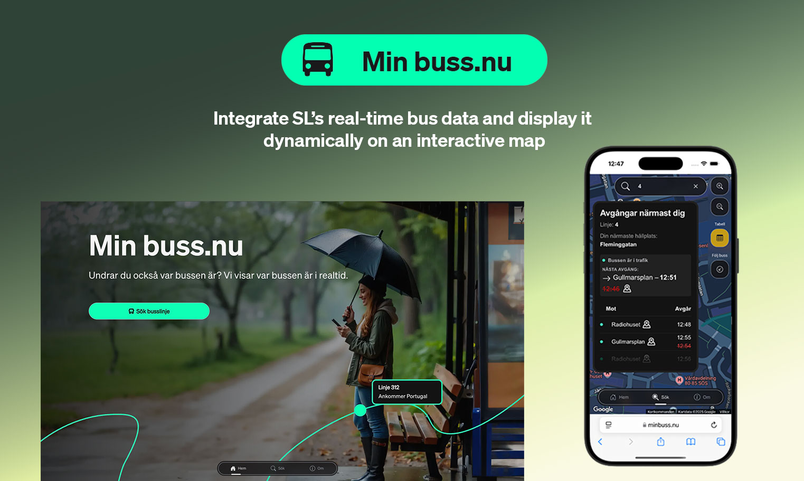

<h1 align="center">
    <a href=""> 
    
    </a>
</h1>

<p align="center">
  <i align="center">Search for a bus line and instantly display busses from SL, Storstockholms Lokaltrafik 🚀</i>
</p>


<p align="center">
    
</p>


## Introduction

`Min Buss.nu` is a Next.js application that show real-time bus information from SL (Storstockholms Lokaltrafik). It uses both static GTFS data and real-time GTFS-RT data from [Trafiklab](https://www.trafiklab.se). The data is rendered on a map from [Google Maps](https://developers.google.com/maps). 

<details>
<summary>
Flowchart
</summary>
<p align="center">
    
</p>
</details>

## Apply for API-keys 

To get started with `Min Buss.nu`, you will need to apply for for two API-keys from Trafiklab. You can get started immediately by following the guide on [Trafiklab](https://www.trafiklab.se/docs/getting-started/using-trafiklab/). For this project you will need one key for `GTFS Regional Realtime` and one key for `GTFS Regional Static Data`. Since we will ask for real-time data quite frequently, you will also need to upgrade the quota for GTFS Regional Realtime to silver.

Next, you need to apply for a key from Google for the [Maps Javascript API](https://developers.google.com/maps/get-started#create-project).


<details>
<summary>
  Tutorials
</summary> <br />

- [Getting started using Trafiklab.se](https://www.trafiklab.se/docs/getting-started/using-trafiklab/)
- [Getting started with Google Maps Platform](https://developers.google.com/maps/get-started#create-project)
</details>


## Create Database and Populate Tables 🗃️

To serve the data, you will need a PostgreSQL-compatible database. This project uses Vercel Postgres, a serverless and scalable solution, but you can choose any database you prefer.

Currently, database migrations are not set up, so some manual steps are required:

Steps:
1. <h4>Create the tables</h4>
Create the following four tables:
- routes
- stop_times
- stops
- trips

You can find the required table structures and data types in the SQL schema files located in the /schema directory of this project. Use these files to create the tables in your database. You can also have a look at the UML diagram below.
<details open>
<summary>
 UML diagram
</summary> <br />


<p align="left">
    
&nbsp;

</details>

2. <h4>Download GTFS Static Data</h4> 
Download the GTFS Regional Static Data from Trafiklab and unzip the file to access the .txt files.

3. <h4>Populate the tables</h4> 
Use a database tool like [DBeaver](https://dbeaver.io/) or a SQL command-line tool to import the text files into the corresponding tables.

## Create .env.local File 🔐
1. <h4>Create the file</h4>
In the root of the project, create a file named .env.local. This file will store your environment variables for local development.

2. <h4>Add your variables</h4>
Place all your environment variables inside this file. For example:
```shell
NEXT_PUBLIC_GOOGLE_MAPS_API_KEY=your-google-maps-api-key
DATABASE_URL=your-database-url
```
3. <h4>Why NEXT_PUBLIC ?</h4>
Environment variables prefixed with NEXT_PUBLIC are exposed to the client-side code in Next.js. Since Google Maps runs on the client, its API key must be prefixed NEXT_PUBLIC to make it accessible in the browser.

4. <h4>Keep it secure</h4>
Ensure .env.local is listed in your .gitignore file to prevent sensitive data from being committed to your repository.


## Clone repo and install dependencies ➕


```shell
git clone https://github.com/StyleSensei/degree-project-where-is-the-bus.git && cd where-is-the-bus && npm install
```


## Getting Started 🎉

First, run the development server:

```bash
npm run dev

```
Open [http://localhost:3000](http://localhost:3000) with your browser to see the result.

## Tech stack 🏗️
<details open>
<summary>
Tech stack
</summary>
<h4>Core Framework and Language</h4>

- Next.js (with App directory): Used for server-side-rendering, routing, and API handling.
- TypeScript: Types! For improved developer experience.

<h4>Styling</h4>

- Sass: Provides advanced CSS features like variables, mixins, and nesting for maintainable and scalable styling.

<h4>API Communication</h4>

- Axios: Used for making HTTP requests to fetch real-time bus data and static GTFS files.

<h4>Database</h4>

- Vercel Postgres: Serverless PostgreSQL database for scalability and easy integration
- Drizzle ORM: For type-safe SQL queries.

<h4>Cache</h4>

- Upstash Redis – Used to avoid unnecessary API calls and improve performance. We cache both real-time data from Trafiklab and static data from the database. 


<h4>ProtoBuf parser</h4>

- GTFS-realtime Language Bindings: For parsing the protobuf format into JavaScript
objects. 

<h4>Unzipper</h4>

- Unzipper: allow access to the underlying files of the zip-archive we get from Trafiklab's `GTFS Regional Static Data` API.

<h4>CSV parser</h4>

 - Csv parser converts the unzipped csv/txt-files into JSON.

<h4>Validation</h4>

- Zod & Drizzle-Zod: Allows us to generate Zod schemas from Drizzle ORM schemas and enable validation during runtime.

<h4>Linting and formatting</h4>

- Biome: Ensures consistent code quality with built-in formatting and linting. 

<h4>Map</h4>

- Google Maps Javascript API: For map visualization.
- @vis.gl/react-google-maps: React integration for efficient map rendering.

<h4>JS Animations</h4>

- GSAP: for smooth movement of the bus markers. 

<h4>Real-time data handling</h4>

- GTFS-RT: For real-time bus position updates.
- Static GTFS data: Used for mapping and bus route metadata.

<h4>Deployment</h4>

- Vercel: For seamless deployment and serverless infrastructure.
</details>

## Cron job for Static Data Updates ♻️
To ensure the static GTFS data remains up-to-date, a GitHub Actions workflow runs the GTFS update script once a month. Trafiklab updates the static data infrequently, so this monthly update is sufficient.

<h4>Using GitHub Actions</h4> 

- This project uses GitHub Actions to schedule and run the cron job. The workflow is configured to run monthly and execute the GTFS update script directly.
- You can find the workflow configuration in the `.github/workflows/cron-job.yml` file.

<details>
<summary>Example GitHub Actions Workflow</summary>

```yaml
name: Run GTFS Update Cron Job

on:
  schedule:
    - cron: '0 3 1 * *' # Once a month at 03:00 UTC on the first day
  workflow_dispatch:     # Allow manual triggering from GitHub

jobs:
  run-cron:
    runs-on: ubuntu-latest

    steps:
      - name: Checkout repository
        uses: actions/checkout@v4

      - name: Setup Node.js
        uses: actions/setup-node@v4
        with:
          node-version: '22'
          cache: 'npm'

      - name: Install dependencies
        run: npm ci

      - name: Build cron job
        run: npm run build:cron

      - name: Run GTFS update script
        run: NODE_PATH=./dist-cron node scripts/updateGTFSData.mjs
        env:
          DATABASE_URL: ${{ secrets.DATABASE_URL }}
          GTFS_REGIONAL_STATIC: ${{ secrets.GTFS_REGIONAL_STATIC }}
```

Replace `${{ secrets.GTFS_UPDATE_URL }}` with your deployed application's cron endpoint URL.
</details>

## Resources 📝
The GTFS Regional API documentation from Trafiklab was a key reference for
understanding how to decode and use real-time transit data.

- [Trafiklab - Overview](https://www.trafiklab.se/api/gtfs-datasets/overview/)
- [Trafiklab - GTFS regional](https://www.trafiklab.se/api/gtfs-datasets/gtfs-regional)
- [Trafiklab - Using Trafiklab data](https://www.trafiklab.se/docs/using-trafiklab-data/the-protobuf-file-format/)
- [GTFS-realtime Language Bindings](https://www.npmjs.com/package/gtfs-realtime-bindings?activeTab=readme)
- [Google Maps API](https://developers.google.com/maps/documentation/javascript/?hl=en)
- [Drizzle ORM](https://orm.drizzle.team/docs/get-started)
- [Biome](https://biomejs.dev/guides/getting-started/)
- [Zod](https://zod.dev/)
- [Axios](https://axios-http.com/docs/intro)
- [Upstash Redis](https://upstash.com/docs/redis/overall/getstarted)
- [unzipper](https://www.npmjs.com/package/unzipper)
- [csv-parser](https://www.npmjs.com/package/csv-parser)


## Learn More

To learn more about Next.js, take a look at the following resources:

- [Next.js Documentation](https://nextjs.org/docs) - learn about Next.js features and API.
- [Learn Next.js](https://nextjs.org/learn) - an interactive Next.js tutorial.


## Deploy on Vercel

The easiest way to deploy your Next.js app is to use the [Vercel Platform](https://vercel.com/new?utm_medium=default-template&filter=next.js&utm_source=create-next-app&utm_campaign=create-next-app-readme) from the creators of Next.js.

Check out [Next.js deployment documentation](https://nextjs.org/docs/app/building-your-application/deploying) for more details.

## Contact
Got questions? Reach out!
- Email: hello@patrikarell.se
- GitHub: [@StyleSensei](https://github.com/StyleSensei)
- Linkedin: https://www.linkedin.com/in/patrikarell/